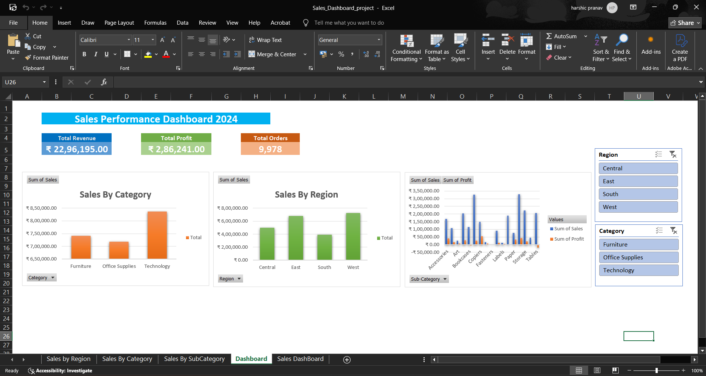

# Sales Performance Dashboard (Excel)

Interactive Sales Performance Dashboard built in Excel using Pivot Tables and Pivot Charts to analyze transaction-level sales data across categories and regions.

## 📊 Dashboard Preview

**Overview**

*(Update this filename to match whatever screenshot you actually upload)*

## 🔍 Key Insights

- Analyzed **9,978 transactions** across **3 categories** and **4 regions**
- Built KPI cards: **Revenue ₹22.96L**, **Profit ₹2.86L**
- **Technology** leads revenue contribution at **36%**
- **West region** is the top-performing region by sales
- **Tables** and **Bookcases** sub-categories flagged as loss-making, highlighting areas for margin improvement

## 🛠 Tools & Techniques

- **Excel Pivot Tables**: Multi-dimensional sales analysis by category, region, and sub-category
- **Pivot Charts**: Dynamic, filterable visualizations for revenue and profit trends
- **KPI Cards**: Summary metrics for quick executive review
- **Data Analysis**: Identified top-performing and loss-making segments to support business decisions

## 📁 Files in this Repo

| File | Description |
|---|---|
| `Sales Performance Dashboard.xlsx` | Full Excel workbook with pivot tables, charts, and KPI cards |
| `dashboard_overview.png` | Screenshot of the main dashboard view |

## 📌 Dataset

Transaction-level sales dataset (9,978 rows) covering category, sub-category, region, revenue, and profit fields.

## 👤 Author

*Harshic Pranav P J*
Data & Procurement Analyst | Aspiring
Data/Business Analyst
[LinkedIn- https://www.linkedin.com/in/.
harshicpranav10]
[portfolio -https://vine-bayberry=
c2d.notion.site/Harshic-
Pranav-393d871aee2f80798610e1723
9a7df12?source=copy_link]
